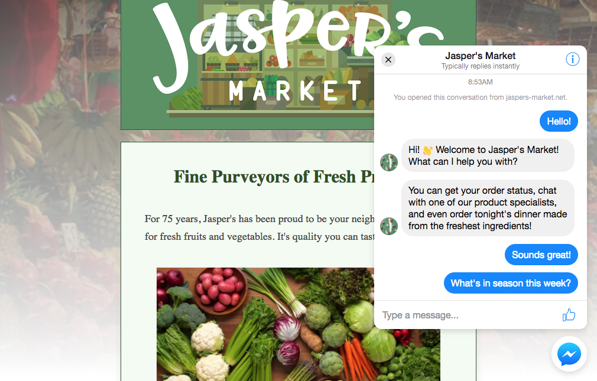

# Grav Facebook Chat (Customer Chat) Plugin

## About

**Facebook Chat (Customer Chat) Plugin** allows you to integrate the Facebook Messenger experience directly into your website. This allows your customers to interact with your business anytime with the same personalized, rich-media experience they get in Messenger.

The customer chat plugin supports all desktop and mobile browsers except Messenger in-app browsers.

*Note*: Support for Safari 12 has been temporarily disabled.

You can learn more about Messenger customer chat by clicking [here](https://developers.facebook.com/docs/messenger-platform/discovery/customer-chat-plugin/)



## Installation

To install this plugin, just download the zip version of this repository and unzip it under `/user/plugins` and rename the folder to `facebook-chat`. You can download the last version from [here](https://github.com/Kuzmanov/grav-plugin-facebook-chat/releases).

**Soon** you should be able to install the plugin from the main Grav repository.

## Configuration

Copy `facebook-chat.yaml` from `/users/plugins/facebook-chat` to `/user/config/plugins/facebook-chat` and configure the plugin:

```
enabled: true
facebook_page_id: <YOUR FACEBOOK PAGE ID>
theme_color: '#0084FF'
logged_in_greeting: 'Hi there, how can I help you?'
logged_out_greeting: 'Hi there, how can I help you?'
greeting_dialog_display: show
greeting_dialog_delay: '4'
```

The customer chat plugin supports the following customizations. All customizations are set as an attribute when the plugin is included on your webpage:

| Attribute | Description |
| --------- | ----------- |
| theme_color | The color to use as a theme for the plugin, including the background color of the customer chat plugin icon and the background color of any messages sent by users. Supports any hexadecimal color code with a leading number sign (e.g. #0084FF), except white. We highly recommend you choose a color that has a high contrast to white. |
| logged_in_greeting | The greeting text that will be displayed if the user is currently logged in to Facebook. Maximum 80 characters. |
| logged_out_greeting | The greeting text that will be displayed if the user is currently not logged in to Facebook. Maximum 80 characters. |
| greeting_dialog_display | Sets how the greeting dialog will be displayed. The following values are supported: 
* `show` - The greeting dialog is shown and remains open on desktop and mobile after the number of seconds set by the greeting_dialog_delay attribute.
* `hide` - The greeting dialog is hidden until a user clicks on the plugin on desktop and mobile. 
* `fade` - fade: The greeting dialog is shown briefly after the number of seconds set by the greeting_dialog_delay attribute, then fades away and is hidden on desktop. The dialog is hidden on mobile. |
| greeting_dialog_delay | Sets the number of seconds of delay before the greeting dialog is shown after the plugin is loaded. This can be used to customize when you want the greeting dialog to appear. |

## Usage

In order to display the Customer Chat, add the following code before the `</body>` tag in your theme:

```
{{ facebookChat() }}
```